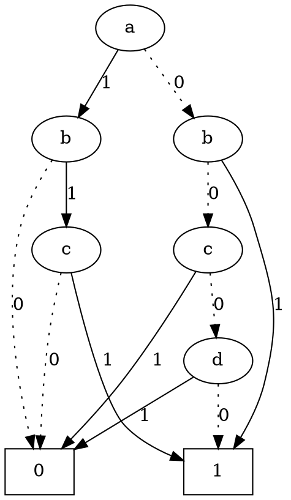
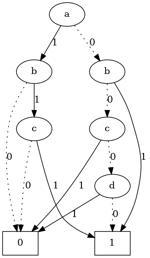
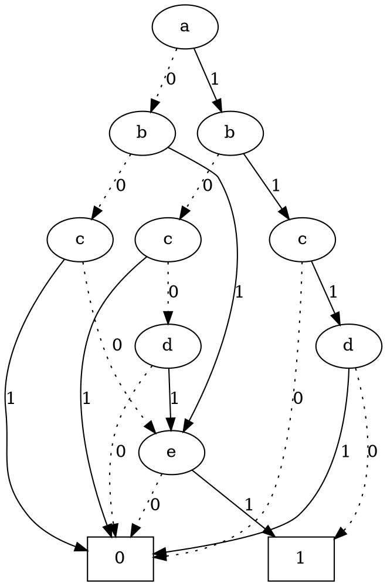
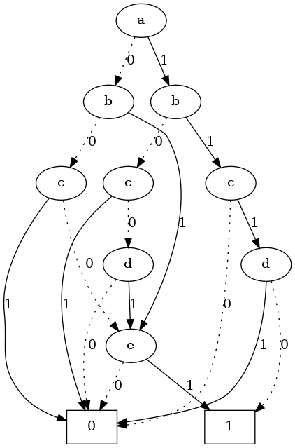

# ROBDD

Reads a single-output Boolean function in PLA format and outputs the corresponding ROBDD in pictorial DOT format.


## Requirement

- gcc/clang with C++17 supported
- CMake


## Build

```bash
mkdir build
cd build
cmake -DCMAKE_BUILD_TYPE=Release ..
cmake --build .
```


## Support Platforms

GCC/Clang


## Run

```bash
./main [input_pla] [output_dot]
```


## Feature

|          | Name            | Description                                              |
| :------: | --------------- | -------------------------------------------------------- |
| &#x2705; | Read file       | Read the content of the pla file.                        |
| &#x2705; | Handle commands | Handle the commands from read from the pla file.         |
| &#x2705; | ROBDD           | Reduce the Binary Decision Diagram.                      |
| &#x2705; | Output file     | Output the dot format file's ROBDD.                      |
| &#x2705; | Output picture  | Outputs the corresponding ROBDD in pictorial DOT format. |


## Test Result

### Case 1 (F = bcd + a'b + abcd' + a'c'd')

[example/case3](./example/case3)

#### Input PLA

``` pla
.i 4
.o 1
.ilb a b c d
.ob F
.p 4
-111 1
01-- 1
1110 1
0-00 1
.e
```

#### Output Dot



#### Generated PNG




### Case 2 (F = bcd'e + a'bd + b'c'de + abcd'e' + a'c'd'e)
[example/case4](./example/case4)

#### Input PLA

``` pla
.i 5
.o 1
.ilb a b c d e
.ob F
.p 5
-1101 1
01--1 1
-0011 1
11100 1
0-001 1
.e
```

#### Output Dot



#### Generated PNG




## Support

Email: allen0523win@gmail.com

Email: B11130225@mail.ntust.edu.tw  